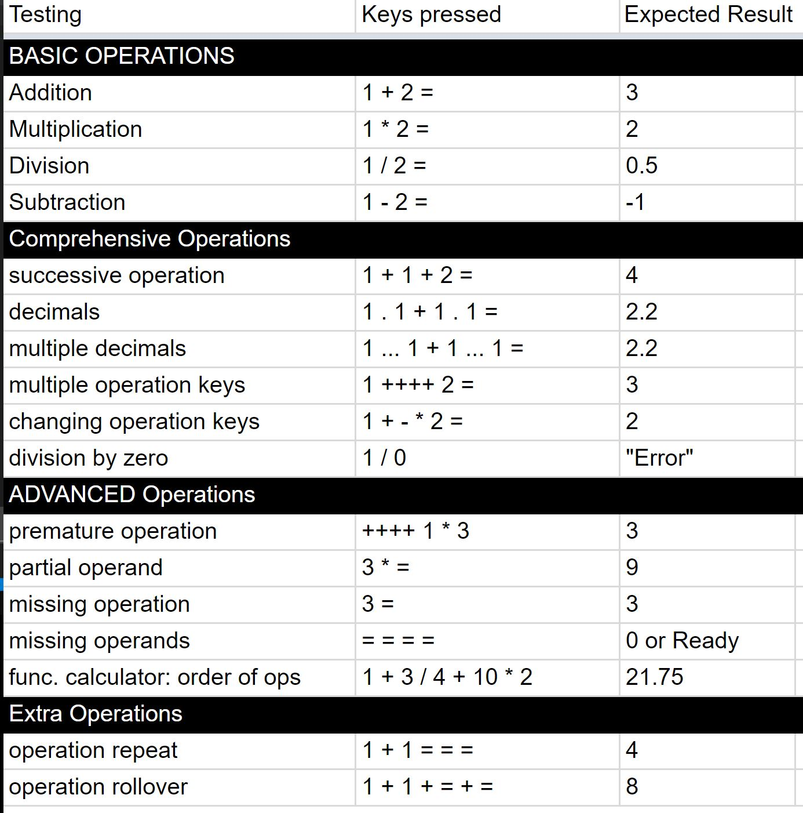

# Calculator

A calculator with automation test 

Website: https://calculator.jeremywang.dev

## How to Use
1. Clone the repo to local
2. Open the index.html

## How to Run Automation Test
1. Click the button `Run Test`, all test cases in spread sheet will be automatically running.

2. Passed test case will be marked to green
3. Failed test case will be marked to red
